<!-- default badges list -->

[](https://supportcenter.devexpress.com/ticket/details/T1143380)
[](https://docs.devexpress.com/GeneralInformation/403183)
[](#does-this-example-address-your-development-requirementsobjectives)
<!-- default badges end -->

# XAF - How to Create a Multi-Tenant Application

XAF v23.2 marks the first official release of the DevExpress Multi-Tenancy Module. This release supports straightforward CRUD usage scenarios and includes the following built-in features:

 - EF Core and XPO ORM support
 - Authentication: Log in with an email/OAuth2 account (like Microsoft Entra ID or Google) and a password (the domain automatically resolves the tenant and its storage).
 - Tenant Isolation: Multi-tenant app with multiple databases (a database per tenant).
 - Database Creation: The application automatically creates a tenant database and schema at runtime (if the database does not exist).

This example application is a modern multi-tenant iteration of our original WinForms-based Outlook Inspired App. It serves as the central data management hub for the fictitious company, overseeing various business entities such as Employees, Products, Orders, Quotes, Customers, and Stores.

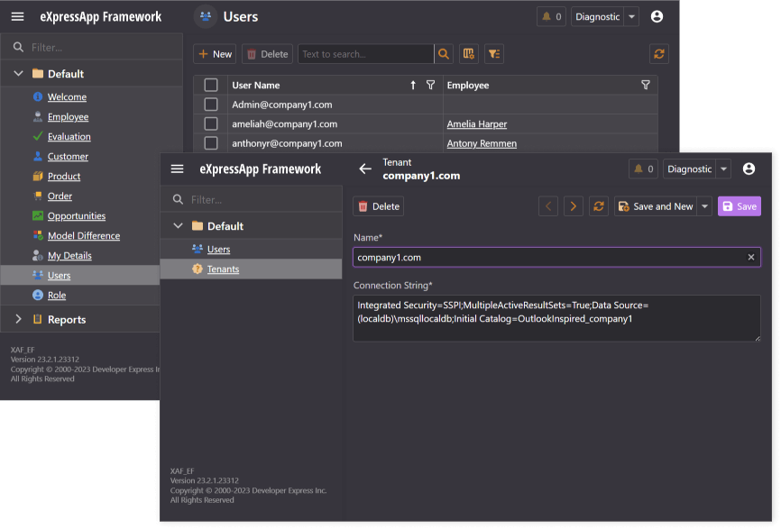

For additional information, refer to the [Multitenancy](https://docs.devexpress.com/eXpressAppFramework/404436/multitenancy) section of our online documentation.

> Before you review this XAF sample project, please take a moment to [complete a short multi-tenancy related survey](https://www.devexpress.com/products/net/application_framework/survey.xml) (share your multi-tenancy requirements with us).

## Run the Application

When you launch the WinForms or Blazor application for the first time, you can login using the "Admin" account and a blank password. The application will execute in Host User Interface mode (used to view, create and edit Tenants).

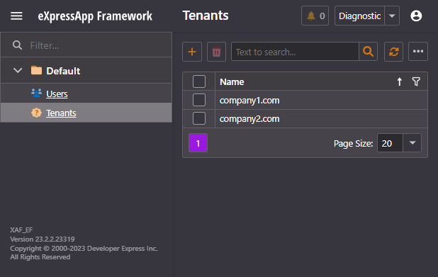

Once you log in, two tenants are created in the system: `company1.com` and `company2.com`. You can view the tenant list in the Host User Interface List View. 

After the Host Database is initialized, you can log in to the Tenant User Interface using one of the following Tenant Administrator accounts

- `admin@company1.com`
- `admin@company2.com`

A Tenant Administrator has full access to all data stored in the Tenant Database but no access to other Tenant data. Users and permissions are managed in each tenant independently.

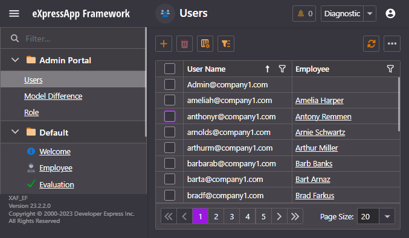

In addition, the sample application creates a list of users with restricted access rights in each tenant (for example `clarkm@company1.com`, `clarkm@company2.com` and others).  

[Documentation](https://docs.devexpress.com/eXpressAppFramework/404436/multitenancy-support?v=24.1) | [Getting Started](https://docs.devexpress.com/eXpressAppFramework/404669/multitenancy/create-new-multitenant-application?v=24.1) | [Best Practices and Limitations](https://docs.devexpress.com/eXpressAppFramework/404436/multitenancy?v=24.1#best-practices-and-limitations)  | [Modules in a Multi-Tenant Application](https://docs.devexpress.com/eXpressAppFramework/404695/multitenancy/modules-in-multitenant-application?v=24.1)

## Implementation Details 

### Enable Multi-Tenancy 

In the Blazor application, the following code activates multi-tenancy.

[OutlookInspired.Blazor.Server/Services/Internal/ApplicationBuilder.cs](https://github.com/DevExpress-Examples/xaf-create-multitenant-application/blob/24.1.2%2B/CS/OutlookInspired.Blazor.Server/Services/Internal/ApplicationBuilder.cs#L44):

```cs
public static IBlazorApplicationBuilder AddMultiTenancy(this IBlazorApplicationBuilder builder, IConfiguration configuration){
    builder.AddMultiTenancy()
        .WithHostDbContext((_, options) => {
#if EASYTEST
            string connectionString = configuration.GetConnectionString("EasyTestConnectionString");
#else
            string connectionString = configuration.GetConnectionString("ConnectionString");
#endif
            options.UseSqlite(connectionString);
            options.UseChangeTrackingProxies();
            options.UseLazyLoadingProxies();
        })
        .WithMultiTenancyModelDifferenceStore(e => {
#if !RELEASE
            e.UseTenantSpecificModel = false;
#endif
        })
        .WithTenantResolver<TenantByEmailResolver>();
    return builder;
}
```

In the WinForms application, the following code activates multi-tenancy.

[OutlookInspired.Win/Services/ApplicationBuilder.cs](https://github.com/DevExpress-Examples/xaf-create-multitenant-application/blob/24.1.2%2B/CS/OutlookInspired.Win/Services/ApplicationBuilder.cs#L79):

```cs
public static IWinApplicationBuilder AddMultiTenancy(this IWinApplicationBuilder builder, string serviceConnectionString) {
    builder.AddMultiTenancy()
        .WithHostDbContext((_, options) => {
            options.UseSqlite(serviceConnectionString);
            options.UseChangeTrackingProxies();
            options.UseLazyLoadingProxies();
        })
        .WithMultiTenancyModelDifferenceStore(mds => {
#if !RELEASE
            mds.UseTenantSpecificModel = false;
#endif
        })
        .WithTenantResolver<TenantByEmailResolver>();
    return builder;
}
```

### Configure ObjectSpaceProviders for Tenants

In the Blazor application: 

[OutlookInspired.Blazor.Server/Services/Internal/ApplicationBuilder.cs](https://github.com/DevExpress-Examples/xaf-create-multitenant-application/blob/24.1.2%2B/CS/OutlookInspired.Blazor.Server/Services/Internal/ApplicationBuilder.cs#L59):

```cs
// ...
builder.WithDbContext<Module.BusinessObjects.OutlookInspiredEFCoreDbContext>((serviceProvider, options) => {
    // ...
    options.UseSqlite(serviceProvider.GetRequiredService<IConnectionStringProvider>().GetConnectionString());
})
// ...
```

In the WinForms application.

[OutlookInspired.Win/Services/ApplicationBuilder.cs](https://github.com/DevExpress-Examples/xaf-create-multitenant-application/blob/24.1.2%2B/CS/OutlookInspired.Win/Services/ApplicationBuilder.cs#L69):

```cs
// ...
builder.WithDbContext<OutlookInspiredEFCoreDbContext>((application, options) => {
  // ...
  options.UseSqlite(application.ServiceProvider.GetRequiredService<IConnectionStringProvider>().GetConnectionString());
}, ServiceLifetime.Transient)
// ...
```

### Populate Databases with Data

A multi-tenant application works with several independent databases:

- Host database – stores a list of Super Administrators and the list of tenants.
- One or multiple tenant databases – store user data independently from other organizations (tenants).

A Tenant database is created and populated with demo data on the first login to the tenant itself.

A list of the tenants is created, and tenant databases are populated with demo data in the Module Updater:

[OutlookInspired.Module/DatabaseUpdate/Updater.cs](https://github.com/DevExpress-Examples/xaf-create-multitenant-application/blob/24.1.2%2B/CS/OutlookInspired.Module/DatabaseUpdate/Updater.cs#L17):

```cs
public override void UpdateDatabaseAfterUpdateSchema() {
  base.UpdateDatabaseAfterUpdateSchema();
  if (ObjectSpace.TenantName() == null) {
    CreateAdminObjects();
    CreateTenant("company1.com", "OutlookInspired_company1");
    CreateTenant("company2.com", "OutlookInspired_company2");
    ObjectSpace.CommitChanges();
  }
  // ...
}

private void CreateTenant(string tenantName, string databaseName) {
    var tenant = ObjectSpace.FirstOrDefault<Tenant>(t => t.Name == tenantName);
    if (tenant == null) {
        tenant = ObjectSpace.CreateObject<Tenant>();
        tenant.Name = tenantName;
        tenant.ConnectionString = $"Integrated Security=SSPI;MultipleActiveResultSets=True;Data Source=(localdb)\\mssqllocaldb;Initial Catalog={databaseName}";
    }
}
```

To determine the tenant whose database is being updated when the Module Updater executes, the `Updater` class includes the `TenantId` and `TenantName` properties that return the current tenant's unique identifier and name respectively. When the Host Database is updated, the tenant is not specified, and these properties return `null`. 

## Solution Overview

### Domain Diagram

The following diagram describes the application's domain architecture:

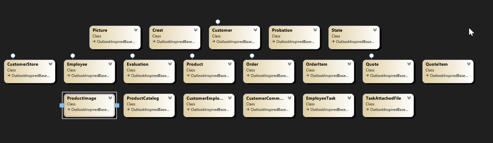

### Solution Structure

The solution consists of three distinct projects.

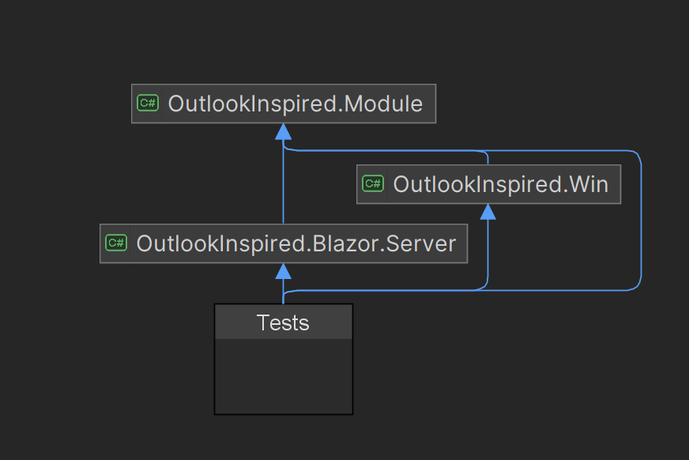
<a name="OutlookInspiredModule"></a>
- **OutlookInspired.Module** - A platform-agnostic module required by all other projects.
- **OutlookInspired.Blazor.Server** - A Blazor port of the original _OutlookInspired_ demo.
- **OutlookInspired.Win** - A WinForms port of the original _OutlookInspired_ demo.

## OutlookInspired.Module project

### Services Folder

This folder serves as the centralized storage for app business logic so that all other class implementations can be compact. For instance, methods that utilize `XafApplication` are located in [Services/Internal/XafApplicationExtensions](https://github.com/DevExpress-Examples/xaf-create-multitenant-application/blob/24.1.2%2B/CS/OutlookInspired.Module/Services/Internal/XafApplicationExtensions.cs):

```cs
public static IObjectSpace NewObjectSpace(this XafApplication application) 
    => application.CreateObjectSpace(typeof(OutlookInspiredBaseObject));
```

Methods that use `IObjectSpace` can be found in [Services/Internal/ObjectSpaceExtensions](https://github.com/DevExpress-Examples/xaf-create-multitenant-application/blob/24.1.2%2B/CS/OutlookInspired.Module/Services/Internal/ObjectSpaceExtensions.cs). For example:

```cs
public static TUser CurrentUser<TUser>(this IObjectSpace objectSpace) where TUser:ISecurityUser 
    => objectSpace.GetObjectByKey<TUser>(objectSpace.ServiceProvider.GetRequiredService<ISecurityStrategyBase>().UserId);
```
The `SecurityExtensions` class configures a diverse set of permissions for each department. For instance, the Management department will have:

1. CRUD permissions for `EmployeeTypes`
2. Read-only permissions for `CustomerTypes`
3. Navigation permissions for `Employees`, `Evaluations`, and `Customers`
4. Mail merge permissions for orders and customers
5. Permissions for various reports including `Revenue`, `Contacts`, `TopSalesMan`, and `Locations`.

[Services/Internal/ObjectSpaceExtensions](https://github.com/DevExpress-Examples/xaf-create-multitenant-application/blob/24.1.2%2B/CS/OutlookInspired.Module/Services/Internal/SecurityExtensions.cs):

```cs
private static void AddManagementPermissions(this PermissionPolicyRole role) 
    => EmployeeTypes.AddCRUDAccess(role)
        .Concat(CustomerTypes.Prepend(typeof(ApplicationUser)).AddReadAccess(role)).To<string>()
        .Concat(new[]{ EmployeeListView,EvaluationListView,CustomerListView}.AddNavigationAccess(role))
        .Finally(() => {
            role.AddMailMergePermission(data => new[]{ MailMergeOrder, MailMergeOrderItem, ServiceExcellence }.Contains(data.Name));
            role.AddReportPermission(data => new[]{ RevenueReport, Contacts, LocationsReport, TopSalesPerson }.Contains(data.DisplayName));
        })
        .Enumerate();
```

### Attributes Folder

The [Attributes](https://github.com/DevExpress-Examples/xaf-create-multitenant-application/tree/24.1.2%2B/CS/OutlookInspired.Module/Attributes) folder contains attribute declarations.

- `FontSizeDeltaAttribute`
  This attribute is applied to properties of `Customer`, `Employee`, `Evaluation`, `EmployeeTask`, `Order`, and `Product` types to configure font size. he implementation is context-dependent; in the WinForms application, this attribute it is used by the `LabelPropertyEditor`...

  [OutlookInspired.Win/Editors/LabelControlPropertyEditor.cs](https://github.com/DevExpress-Examples/xaf-create-multitenant-application/blob/24.1.2%2B/CS/OutlookInspired.Win/Editors/LabelControlPropertyEditor.cs):

  ```cs
   protected override object CreateControlCore() 
   => new LabelControl{
         BorderStyle = BorderStyles.NoBorder,
         AutoSizeMode = LabelAutoSizeMode.None,
         ShowLineShadow = false,
         Appearance ={
            FontSizeDelta = MemberInfo.FindAttribute<FontSizeDeltaAttribute>()?.Delta??0,
            TextOptions = { WordWrap =MemberInfo.Size==-1? WordWrap.Wrap:WordWrap.Default}
         }
   };
  ```

  ... and the `GridView`.

  [OutlookInspired.Win/Services/Internal/Extensions.cs](https://github.com/DevExpress-Examples/xaf-create-multitenant-application/blob/24.1.2%2B/CS/OutlookInspired.Win/Services/Internal/Extensions.cs):

  ```cs
   public static void IncreaseFontSize(this GridView gridView, ITypeInfo typeInfo){
      var columns = typeInfo.AttributedMembers<FontSizeDeltaAttribute>().ToDictionary(
            attribute => gridView.Columns[attribute.memberInfo.BindingName].VisibleIndex,
            attribute => attribute.attribute.Delta);
      gridView.CustomDrawCell += (_, e) => {
            if (columns.TryGetValue(e.Column.VisibleIndex, out var column)) e.DrawCell( column);
      };
   }
  ```

  

  In the Blazor application, `FontSizeDeltaAttribute` dependent logic is implemented in the following extension method.
  
  [OutlookInspired.Blazor.Server/Services/Internal/Extensions.cs](https://github.com/DevExpress-Examples/xaf-create-multitenant-application/blob/24.1.2%2B/CS/OutlookInspired.Blazor.Server/Services/Internal/Extensions.cs#L83):

  ```cs
    public static string FontSize(this IMemberInfo info){
        var fontSizeDeltaAttribute = info.FindAttribute<FontSizeDeltaAttribute>();
        return fontSizeDeltaAttribute != null ? $"font-size: {(fontSizeDeltaAttribute.Delta == 8 ? "1.8" : "1.2")}rem" : null;
    }
  ```

  The attribute is used like its WinForms application counterpart:
  
  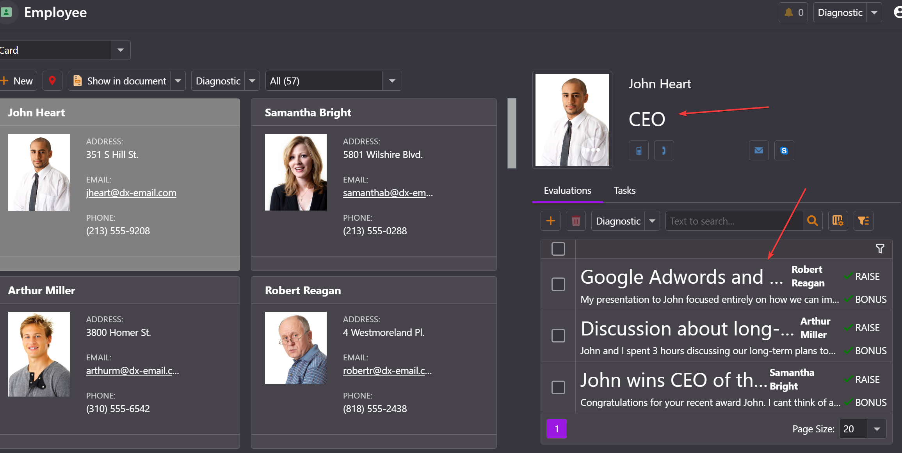

- #### Appearance Subfolder

  The following [Conditional Appearance module](https://docs.devexpress.com/eXpressAppFramework/113286/conditional-appearance) attributes are in this subfolder:

  `DeactivateActionAttribute`: This is an extension of the [Conditional Appearance module](https://docs.devexpress.com/eXpressAppFramework/113286/conditional-appearance) used to deactivate actions.

  [Attributes/Appearance/DeactivateActionAttribute.cs](https://github.com/DevExpress-Examples/xaf-create-multitenant-application/blob/24.1.2%2B/CS/OutlookInspired.Module/Attributes/Appearance/DeactivateActionAttribute.cs):

  ```cs
  puOutlookInspired.Blazor.Server/Services/Internal/Extensions.csbute {
      public DeactivateActionAttribute(params string[] actions) : 
          base($"Deactivate {string.Join(" ", actions)}", DevExpress.  ExpressApp.ConditionalAppearance.AppearanceItemType.Action, "1=1")   {
          Visibility = ViewItemVisibility.Hide;
          TargetItems = string.Join(";", actions);
      }
  }
  
  ```

  In much the same way, we derive from this attribute to create other attributes found in the same folder (`ForbidCRUDAttribute`, `ForbidDeleteAttribute`,`ForbidDeleteAttribute`).

- #### Validation Subfolder 
  This folder includes attributes that extend the [XAF Validation module](https://docs.devexpress.com/eXpressAppFramework/113684/validation-module). Available attributes include: `EmailAddressAttribute`, `PhoneAttribute`, `UrlAttribute`, `ZipCodeAttribute`. The following code snippet illustrates how the `ZipCodeAttribute` is implemented. Other attributes are implemented in a similar fashion.

  [Attributes/FontSizeDeltaAttribute.cs](https://github.com/DevExpress-Examples/xaf-create-multitenant-application/blob/24.1.2%2B/CS/OutlookInspired.Module/Attributes/FontSizeDeltaAttribute.cs):

  ```cs
  public class ZipCodeAttribute : RuleRegularExpressionAttribute {
      public ZipCodeAttribute() : base(@"^[0-9][0-9][0-9][0-9][0-9]$") {
          CustomMessageTemplate = "Not a valid ZIP code.";
      }
  }
  ```

### Controllers Folder
This folder contains controllers with no dependencies:

* The `HideToolBarController` - extends the XAF `IModelListView` interface with a `HideToolBar` attribute so we can hide the nested list view toolbar. 
* <a name="splitter"></a>The `SplitterPositionController` - extends the XAF model with a `RelativePosition` property used to configure the splitter position.

### Features Folder
This folder implements features specific to the solution.

- ##### CloneView Subfolder

  This subfolder contains the [CloneViewAttribute](https://github.com/DevExpress-Examples/xaf-create-multitenant-application/blob/24.1.2%2B/CS/OutlookInspired.Module/Features/CloneView/CloneViewAttribute.cs) declaration, used to generate views (in addition to default views). For example:

  [BusinessObjects/Employee.cs](https://github.com/DevExpress-Examples/xaf-create-multitenant-application/blob/24.1.2%2B/CS/OutlookInspired.Module/BusinessObjects/Employee.cs#L22):

  ```cs
  [CloneView(CloneViewType.DetailView, LayoutViewDetailView)]
  [CloneView(CloneViewType.DetailView, ChildDetailView)]
  [CloneView(CloneViewType.DetailView, MapsDetailView)]
  [VisibleInReports(true)]
  [ForbidDelete()]
  public class Employee : OutlookInspiredBaseObject, IViewFilter,   IObjectSpaceLink, IResource, ITravelModeMapsMarker {
      public const string MapsDetailView = "Employee_DetailView_Maps";
      public const string ChildDetailView = "Employee_DetailView_Child";
      public const string LayoutViewDetailView =   "EmployeeLayoutView_DetailView";
      // ...
  }
- #### Customers Subfolder
  This subfolder includes Customer-related controllers, such as:

  - ##### MailMergeController
    XAF ships with built-in [mail merge](https://docs.devexpress.com/eXpressAppFramework/400006/document-management/office-module/mail-merge) support. This controller modifies the default `ShowInDocumentAction` icons.

      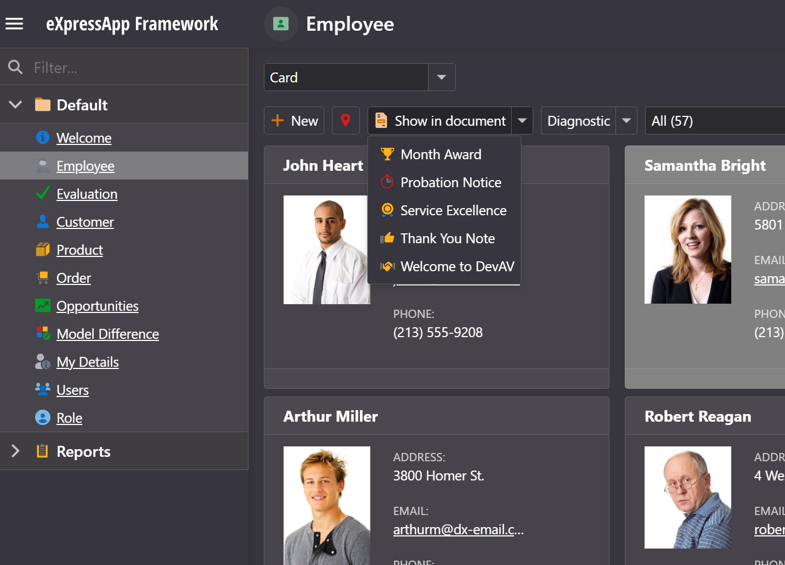

  - ##### ReportsController
    This controller declares an action used to display Customer Reports. (The [XAF Reports module](https://docs.devexpress.com/eXpressAppFramework/113591/shape-export-print-data/reports/reports-v2-module-overview) API is used).

      

- #### Employees Subfolder
  This subfolder includes Employee-related controllers such as:

  - ##### RoutePointController
    This controller sets travel distance (calculated using the MAP service).

    WindowsForms:
    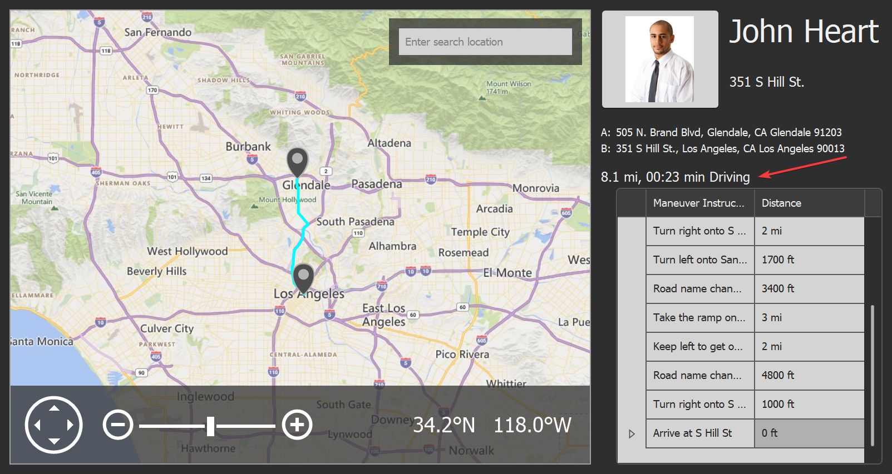

    Blazor:
    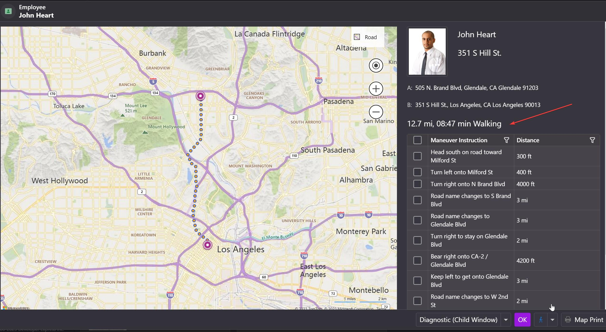

- ##### Maps Subfolder

  This subfolder includes mapping-related logic, including:

  - ##### MapsViewController

    This controller declares map-related actions (`MapItAction`, `TravelModeAction`, `ExportMapAction`, `PrintPreviewMapAction`, `PrintAction`, `StageAction`, `SalesPeriodAction`) and manages associated state based on `ISalesMapMarker` and `IRoutePointMapMarker` interfaces.

- #### MasterDetail Subfolder
  This subfolder adds platform-agnostic master-detail capabilities based on XAF's [DashboardViews](https://docs.devexpress.com/eXpressAppFramework/DevExpress.ExpressApp.DashboardView).

  - ##### MasterDetailController, IUserControl
    The `IUserControl` is implemented in a manner similar to the technique described in the following topic: [How to: Include a Custom UI Control That Is Not Integrated by Default (WinForms, ASP.NET WebForms, and ASP.NET Core Blazor)](https://docs.devexpress.com/eXpressAppFramework/113610/ui-construction/using-a-custom-control-that-is-not-integrated-by-default/using-a-custom-control-that-is-not-integrated-by-default). The distinction lies in the addition of `UserControl` (for WinForms) and the Component (for Blazor) to a `DetailView`.

- #### Orders Subfolder
  This subfolder includes functionality specific to the Sales moduel.

  - ##### FollowUpController
    Declares an action used to display the follow-up mail merge template for the selected order.
    
    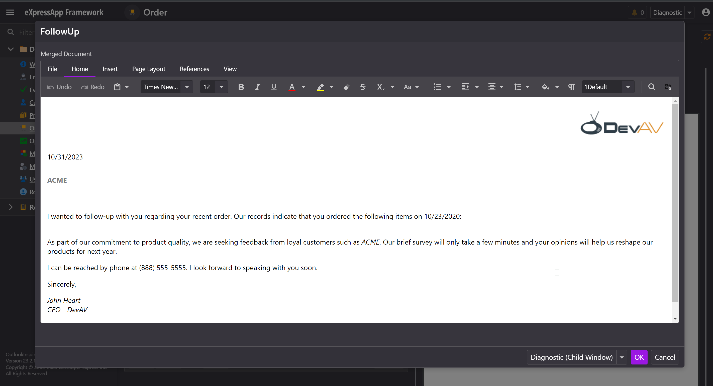

  - ##### InvoiceController
    Uses a master-detail mail merge template pair to generate an invoice, converts it to a PDF, and displays it using the `PdfViewEditor`.
  
  - ##### Pay/Refund Controllers
    These controllers declare actions used to mark the selected order as either Paid or Refunded.
  
  - ##### ReportController
    Provides access to Order Revenue reports.

    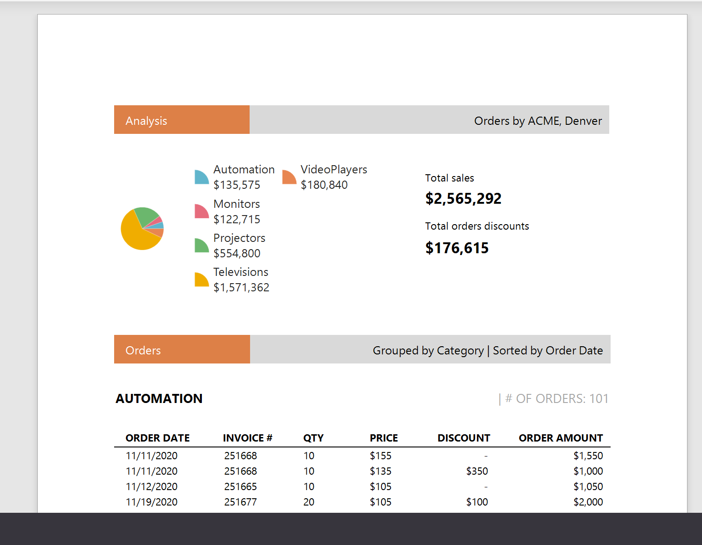

  - ##### ShipmentDetailController
    Adds a watermark to the Shipment Report based on order status.

    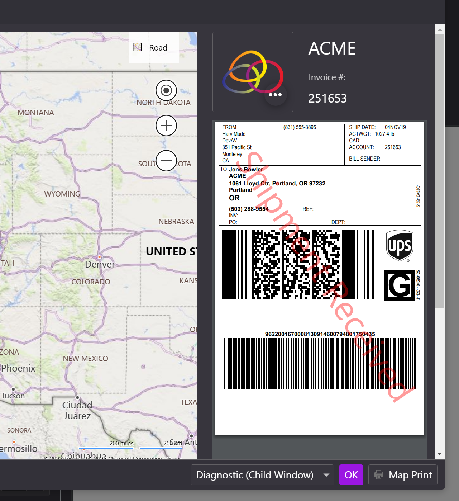
    

- #### Products Subfolder
  This subfolder includes functionality specific to the Products module.

  - ##### ReportsController
    Declares an action used to display reports for Sales, Shipments, Comparisons, and Top Sales Person.
  
    
  

- #### Quotes Subfolder
  This subfolder includes functionality specific to the Quotes module.

  - ##### QuoteMapItemController
    Calculates non-persistent `QuoteMapItem` objects used by the Opportunities view
  
    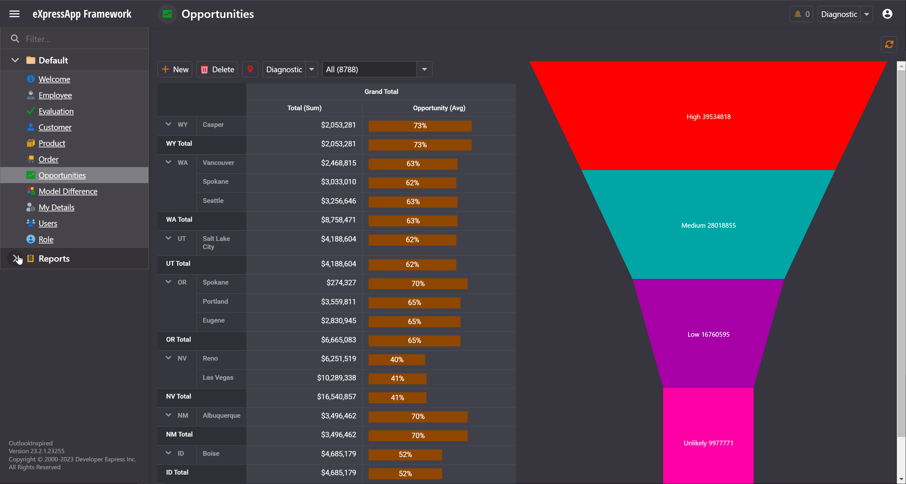

- #### ViewFilter Subfolder
  This subfolder includes our implementation of a Filter manager, used by the end-user to create and save view filters.
  
  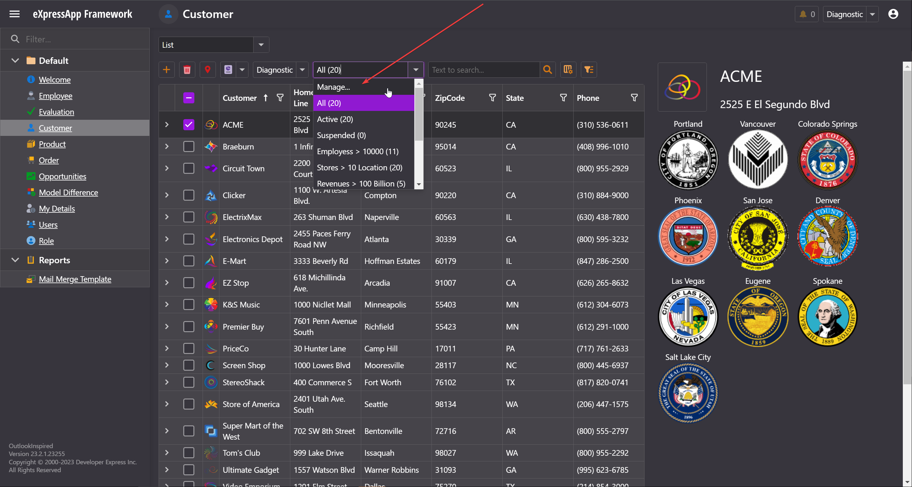
  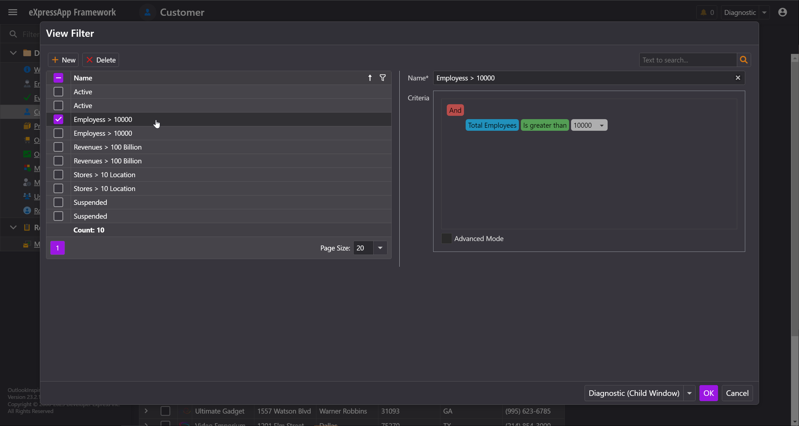

## OutlookInspired.Win project
This is a WinForms frontend project. It utilizes the previously mentioned `OutlookInspired.Module` and adheres to the same folder structure.

### Controllers Folder
This folder contains the following controllers with no dependencies:

- `DisableSkinsController` - This controller disables the XAF default theme-switching action.

- **`SplitterPositionController`** - This is the WinForms implementation of the SplitterPositionController. We discussed its platform agnostic counterpart in the `OutlookInspired.Module` section.

### Editors Folder
This folder contains custom controls and XAF [property editors](https://docs.devexpress.com/eXpressAppFramework/113097/ui-construction/view-items-and-property-editors/property-editors).

- `ColumnViewUserControl` - This is a base control that implements IUserControl discussed previously.

- `EnumPropertyEditor` - This is a subclass of the built-in `EnumPropertyEditor` (it only displays an image).
   
   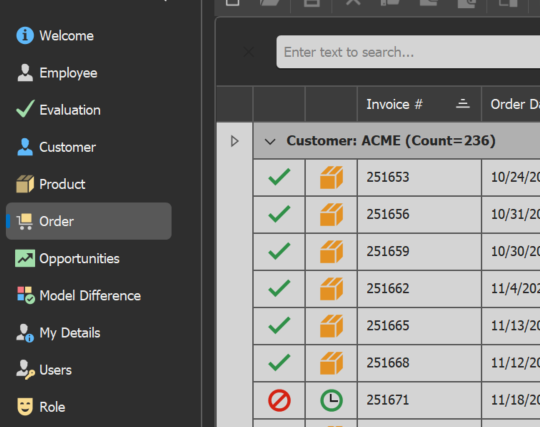

- `HyperLinkPropertyEditor` - This editor displays hyperlinks with mailto support.

   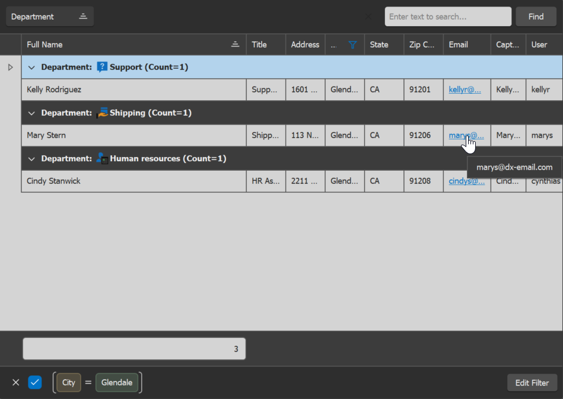

- `LabelControlPropertyEditor` - This is an editor that renders a label.

  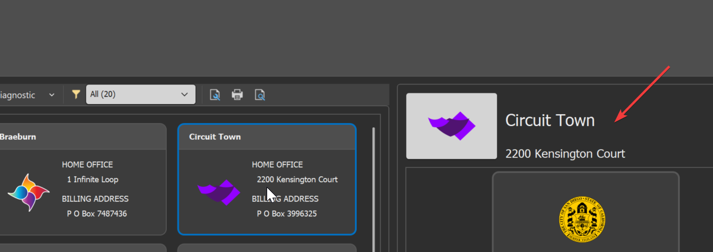

- `PdfViewerEditor` - This is a PDF viewer based on the [DevExpress PDF Viewer](https://docs.devexpress.com/WindowsForms/15216/controls-and-libraries/pdf-viewer) component.

  

- `PrintLayoutRichTextEditor` - This editor extends the built-in `RichTextPropertyEditor`, but uses the `PrintLayout` mode.

- `ProgressPropertyEditor` - This editor is used to display progress across various contexts.

  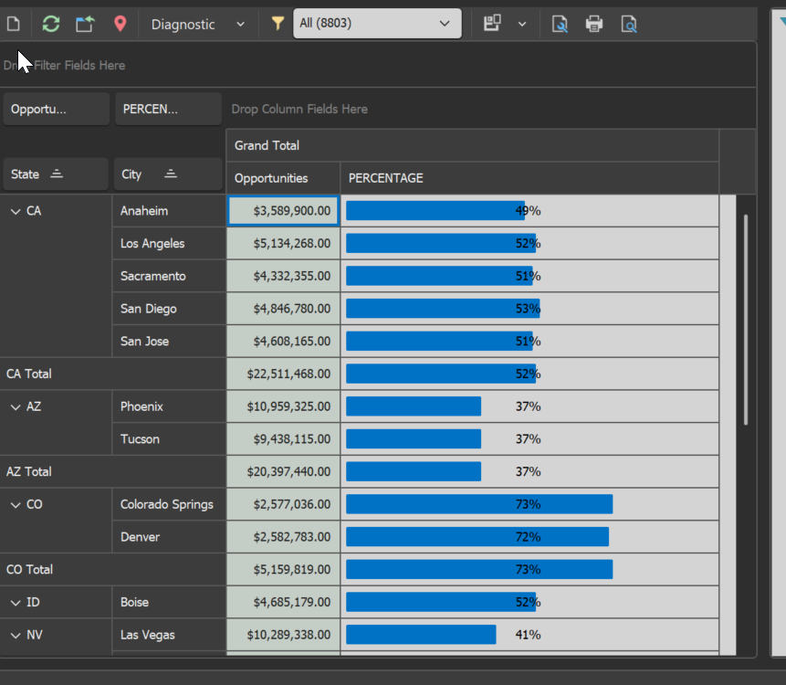

### Services Folder

Much like the platform-agnostic module's [Services Folder](#services-folder), our WinForms project keeps all classes as small as possible and implements business logic in extension methods.

### Features Folder

This folder contains custom functionality specific to the solution.

- #### Maps Subfolder

  This subfolder includes logic related to mapping.

  - **MapsViewController** - This controller overrides the platform-agnostic `MapsViewController` to further configure the state of map actions.
  
  - **WinMapsViewController** - This is an abstract controller that provides functionality used by its derived classes - `SalesMapsViewController` and `RouteMapsViewController`. The controller configures Map views for all objects that implement `ISalesMapsMarker` (Customer, Product) and `IRouteMapsMarker` (Order, Employee) interfaces.
  
  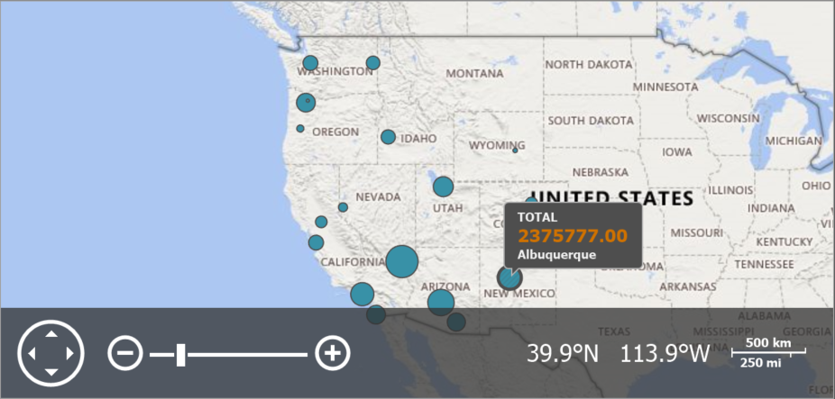
  
  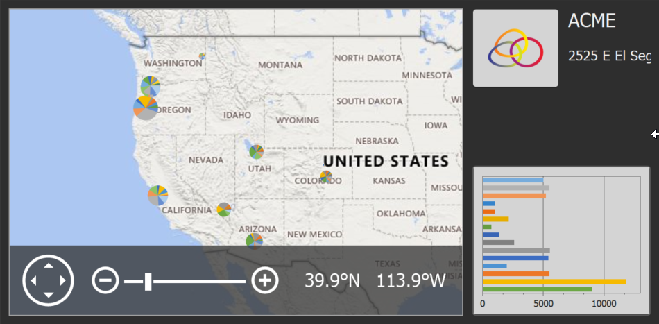

- #### Customers Subfolder

  This subfolder contains customer module-related functionality.

  - **CustomerGridView**, **CustomerLayoutView**, and **CustomerStoreView**: These classes derive from the previously discussed `ColumnViewUserControl`. They host custom `GridControl` variants, such as master-detail layouts.
  
  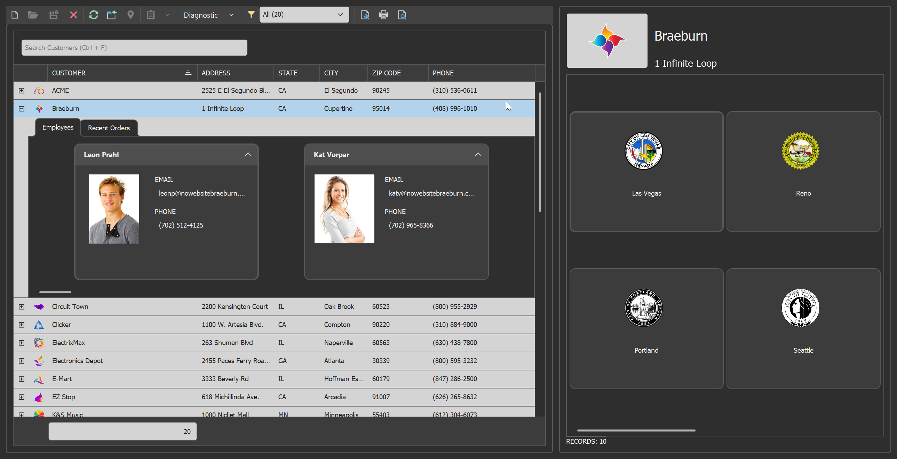

- #### Employees Subfolder

  This subfolder contains employee module-related functionality.

  - **EmployeesLayoutView** - This is a descendant of `ColumnViewUserControl` that hosts a GridControl LayoutView.

  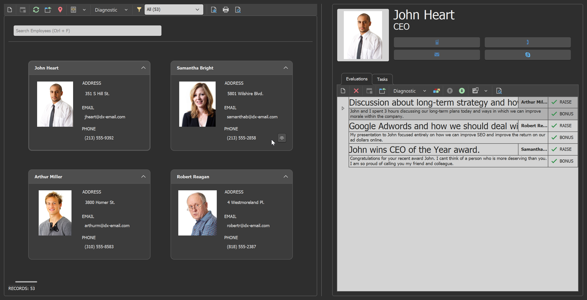

- #### GridListEditor Subfolder

  This subfolder contains functionality related to the default XAF GridListEditor.

  - `FontSizeController` - Uses the `FontSizeDelta` discussed in the platfrom-agnostic module section to increase font size in row cells of an AdvancedBanded Grid.

  - `NewItemRowHandlingModeController` - Modifies how new object are handled when a dashboard master detail view (discussed in the platform-agnostic module section) objects are created.

- #### Products Subfolder

  This subfolder contains functionality related to products.
  
  - `ProductCardView` - This is a descendant of `ColumnViewUserControl` that hosts a GridControl LayoutView.

    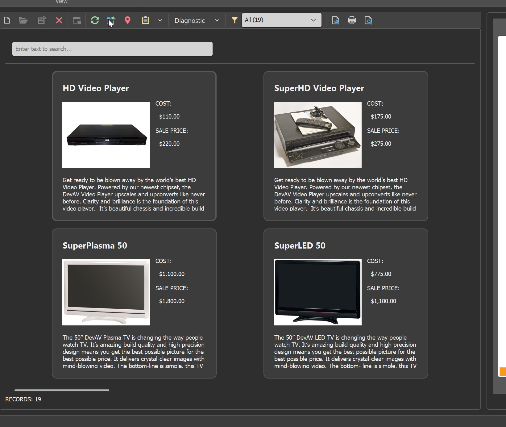

- #### Quotes Subfolder

  This subfolder contains opportunity module-related functionality.

  - `WinMapsController`, `PaletteEntriesController` - Configures the opportunities maps view.

     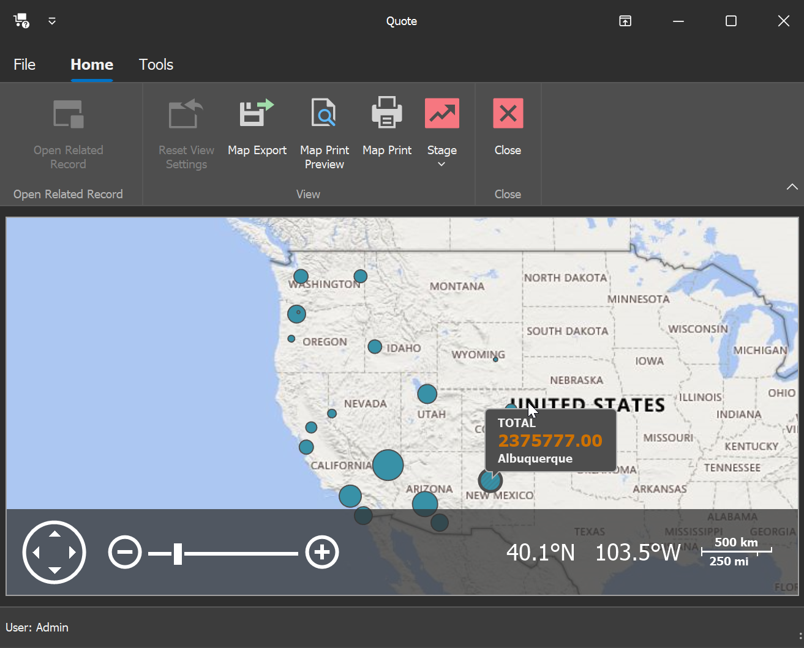 

  - `FunnelFilterController` - Filters the Funnel chart when the FilterManager discussed in the platform-agnostic module section is executed.
  - `PropertyEditorController` - Assigns progress to the Pivot cell.

    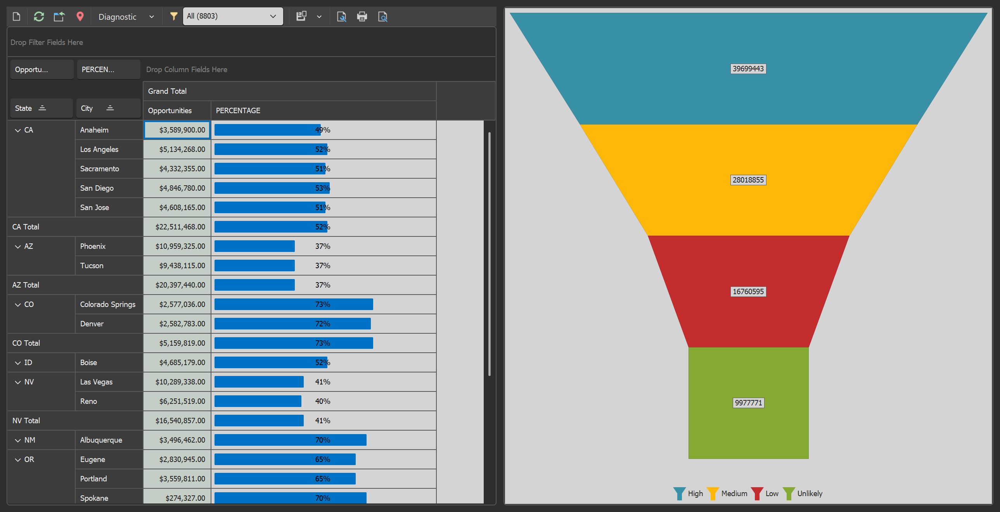

    
## OutlookInspired.Blazor.Server Project
This is the Blazor frontend project. It utilizes the previously mentioned `OutlookInspired.Module` and maintains the same folder structure.

### Components Folder
This folder contains Blazor components essential for project requirements.

- **ComponentBase, ComponentModelBase** - `ComponentBase`  is the foundation for client-side components like DxMap, DxFunnel, DXPivot, and PdfViewer. It manages loading of resources such as JavaScript files. `ComponentModelBase` acts as the base model for all components, offering functionality such as `ClientReady` event and a hook for browser console messages, among other features.

- **HyperLink, Label** - TThese components mirror their WinForms counterparts and are used to render hyperlinks and labels.

  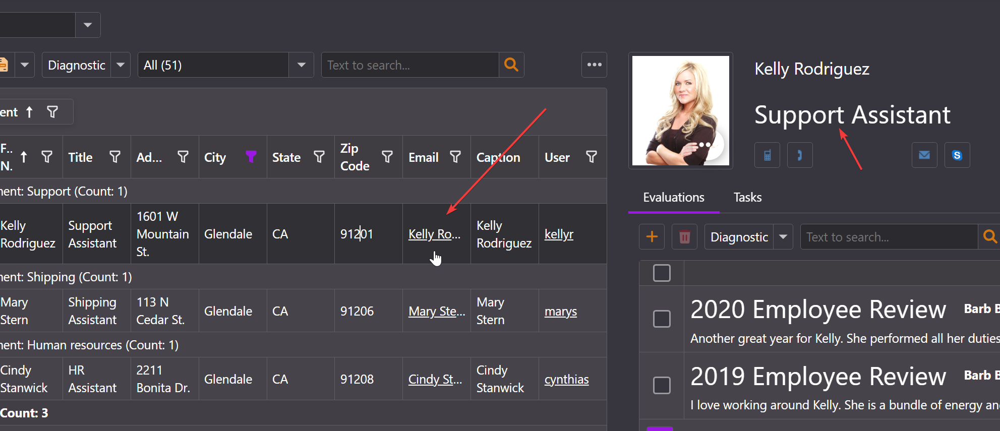

- **PdfViewer** - This is a `ComponentBase` descendant used to view PDF files.

  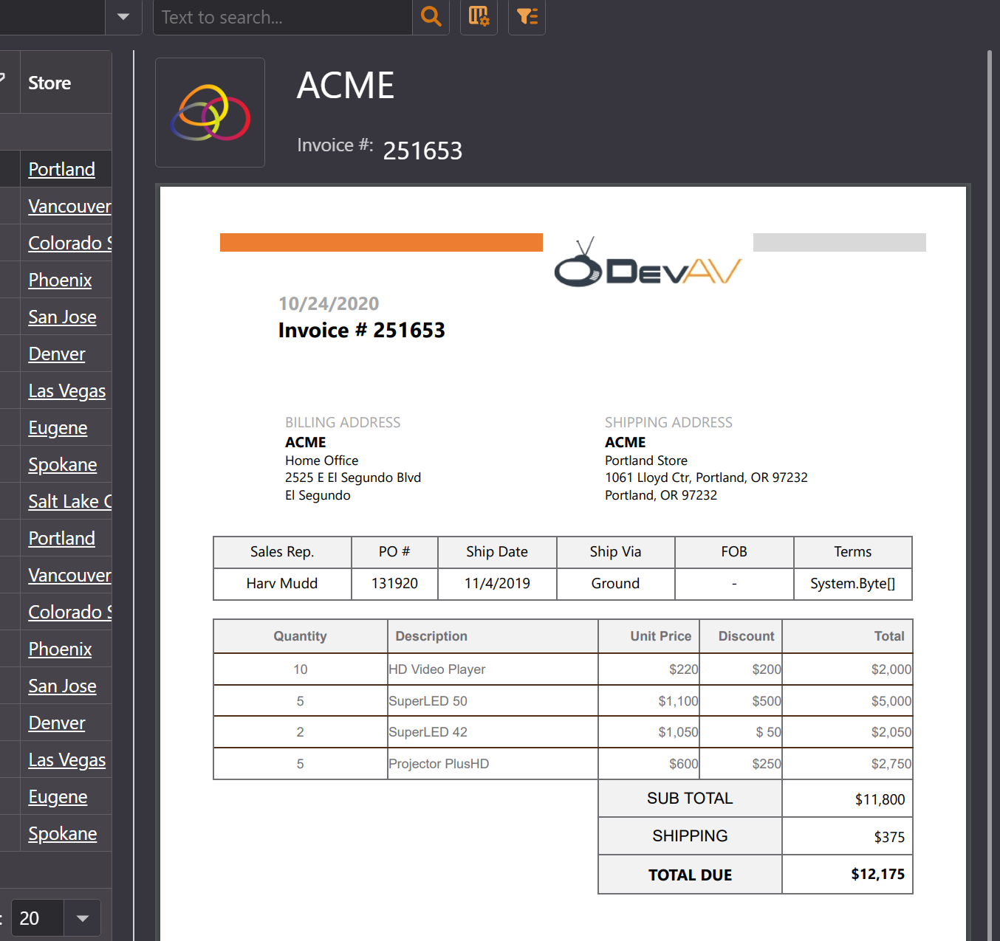

- **XafImg, BOImage** - Both components are used to display images across a variety of contexts.

  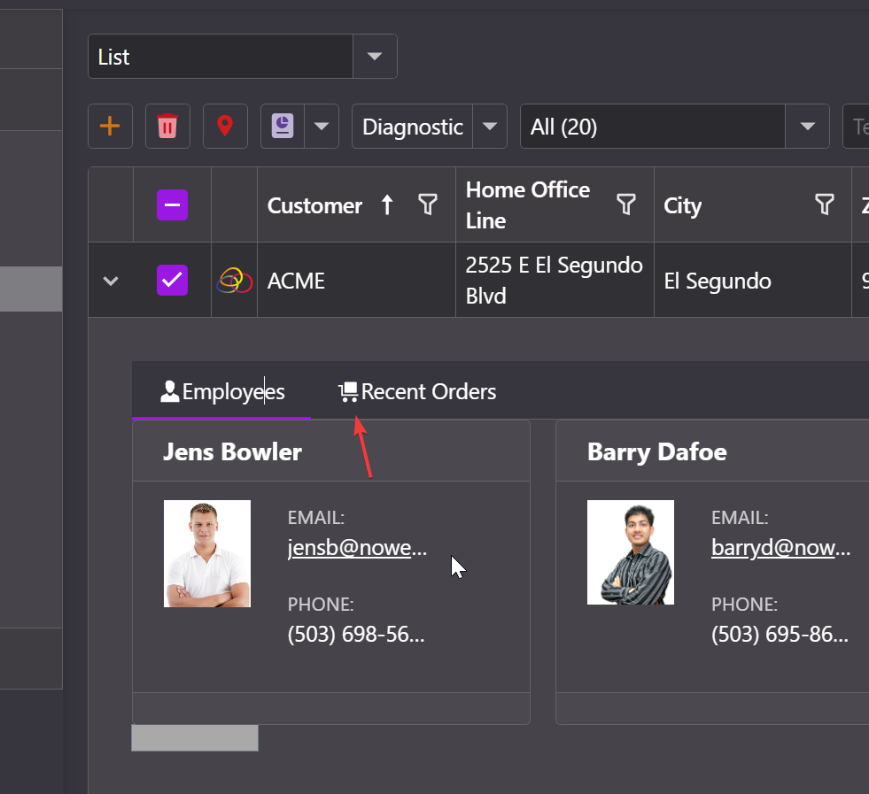
  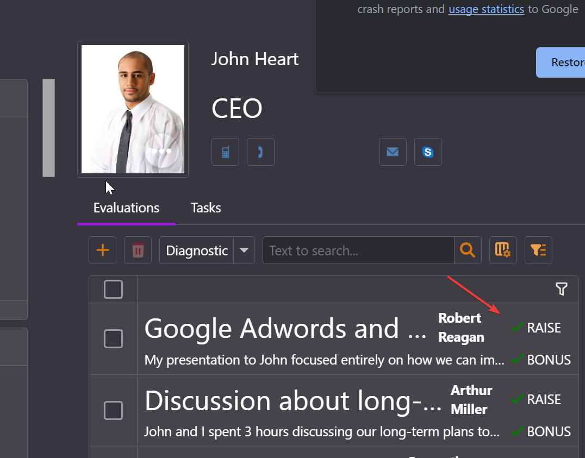

- **XafChart** - This component is utilized for charting Customer store data.

  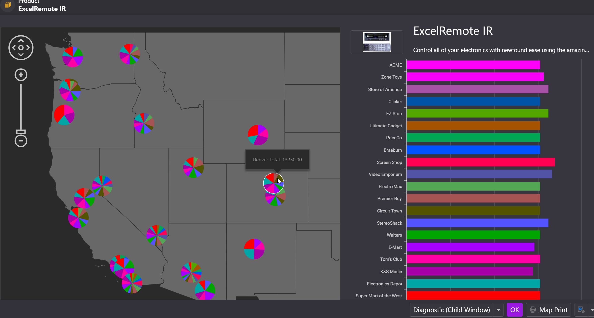

- #### CardView Subfolder
  
  This folder contains the `SideBySideCardView` and the `StackedCardView`. They are used to display Card like list views as follows:
  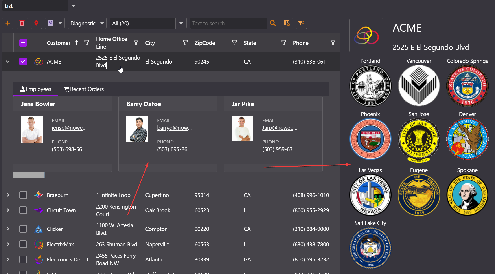

- #### DevExtreme Subfolder

  This folder includes reusable .NET components, including [Map](https://js.devexpress.com/jQuery/Demos/WidgetsGallery/Demo/Map/Markers/Light/), [VectorMap](https://js.devexpress.com/jQuery/Demos/WidgetsGallery/Demo/VectorMap/Overview/Light/), [Funnel](https://js.devexpress.com/jQuery/Demos/WidgetsGallery/Demo/Charts/FunnelChart/Light/) and [Chart](https://js.devexpress.com/jQuery/Demos/WidgetsGallery/Demo/Charts/Overview/Light/) DevExtreme Widgets.


### Controllers Folder
This folder contains the following controllers with no dependencies:

- `CellDisplayTemplateController` - Is an abstract controller that allows the application to render GridListEditor row cell fragments.
- `DxGridListEditorController` - Overiddes GridListEditor behaviors (such as removing command columns).
- `PopupWindowSizeController` - Configures the size of popup windows.

### Editors Folder
This folder contains XAF custom editors. Examples include:

- `ChartListEditor` - An abstract list editor designed to create simple object-specific variants.
  
  [Editors/ChartListEditor.cs](https://github.com/DevExpress-Examples/xaf-create-multitenant-application/blob/24.1.2%2B/CS/OutlookInspired.Blazor.Server/Editors/ChartListEditor.cs):

  ```csharp
  [ListEditor(typeof(MapItem), true)]
  public class MapItemChartListEditor : ChartListEditor<MapItem, string, decimal, string, XafChart<MapItem, string, decimal, string>> {
      public MapItemChartListEditor(IModelListView info) : base(info) {
      }
  }

- `BlazorPropertyEditor` - An abstract property editor that serves as a basis for editors such as `ProgressPropertyEditor` or `PdfViewEditor`. The latter uses the PdfViewer component from the _Components_ folder.

  [Editors/BlazorPropertyEditor.cs](https://github.com/DevExpress-Examples/xaf-create-multitenant-application/blob/24.1.2%2B/CS/OutlookInspired.Blazor.Server/Editors/BlazorPropertyEditor.cs):

  ```cs
  [PropertyEditor(typeof(byte[]),EditorAliases.PdfViewerEditor)]
  public class PdfViewerEditor:BlazorPropertyEditor<PdfViewer,PdfModel>{
      public PdfViewerEditor(Type objectType, IModelMemberViewItem model) : base(objectType, model){
      }

      protected override void ReadValueCore(){
          base.ReadValueCore();
          ComponentModel.Bytes = (byte[])PropertyValue;
      }
  }
  ```
- `EnumPropertyEditor` - Inherits from XAF's native _EnumPropertyEditor_, but only displays an image (like its WinForms counterpart).

- `DisplayTestPropertyEditors` - Displays raw text (like the WinForms _LabelPropertyEditor_).

### Features Folder

This folder contains solution-specific functionality.

- #### Customers subfolder
  Uses components from `Components` (bound to data) to render customer-related data. For example, it uses the `StackedCardView` with a `StackedInfoCard` as shown below:

  [Features/Customers/Stores/StoresCardView.razor](https://github.com/DevExpress-Examples/xaf-create-multitenant-application/blob/24.1.2%2B/CS/OutlookInspired.Blazor.Server/Features/Customers/Stores/StoresCardView.razor):

  ```razor
  <StackedCardView>
    <Content>
        @foreach (var store in ComponentModel.Stores){
            <StackedInfoCard Body="@store.City" Image="@store.Crest.LargeImage.ToBase64Image()"/>
        }
    </Content>
 </StackedCardView>
  ```

  The visual output is as follows:

  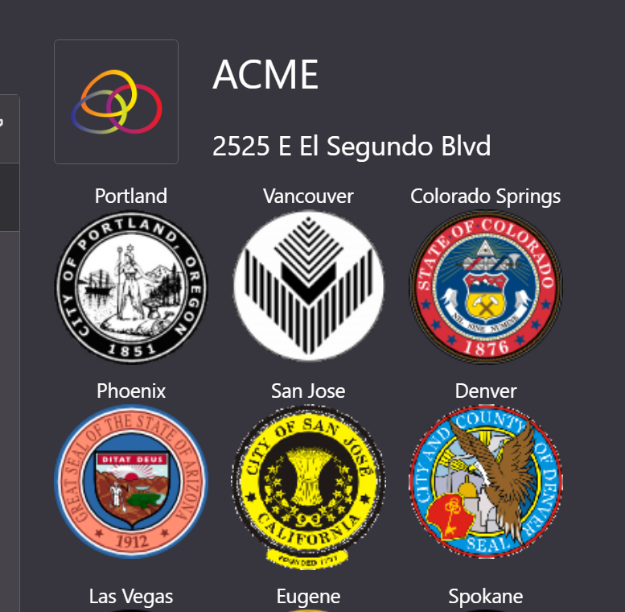

  
- #### Employees subfolder
  
  Uses data-bound components from the `Components` folder to render employee-related data.

  [Features/Employees/CardView/CardView.razor](https://github.com/DevExpress-Examples/xaf-create-multitenant-application/blob/24.1.2%2B/CS/OutlookInspired.Blazor.Server/Features/Employees/CardView/CardView.razor):

  ```razor
  <StackedCardView >
    <Content>
        @foreach (var employee in ComponentModel.Objects){
            <SideBySideInfoCard CurrentObject="employee" ComponentModel="@ComponentModel" Image="@employee.Picture?.Data?.ToBase64Image()" HeaderText="@employee.FullName" 
                                InfoItems="@(new Dictionary<string, string>{{ "ADDRESS", employee.Address },
                                               { "EMAIL", $"<a href=\"mailto:{employee.Email}\">{employee.Email}</a>" },{ "PHONE", employee.HomePhone } })"/>
        }
    </Content>
</StackedCardView>
  ```

  Results are as follows:

  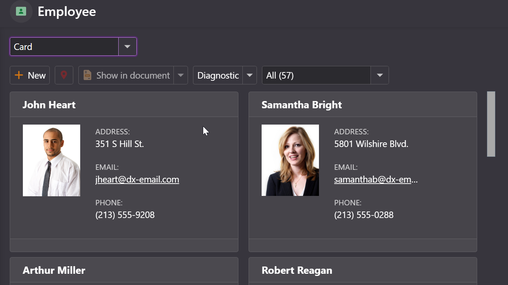

  The `Evaluations` and `Tasks` include components responsible for rendering the cell fragment in the following image. Both components are linked to the cell through `Controllers\CellDisplayTemplateController`.

  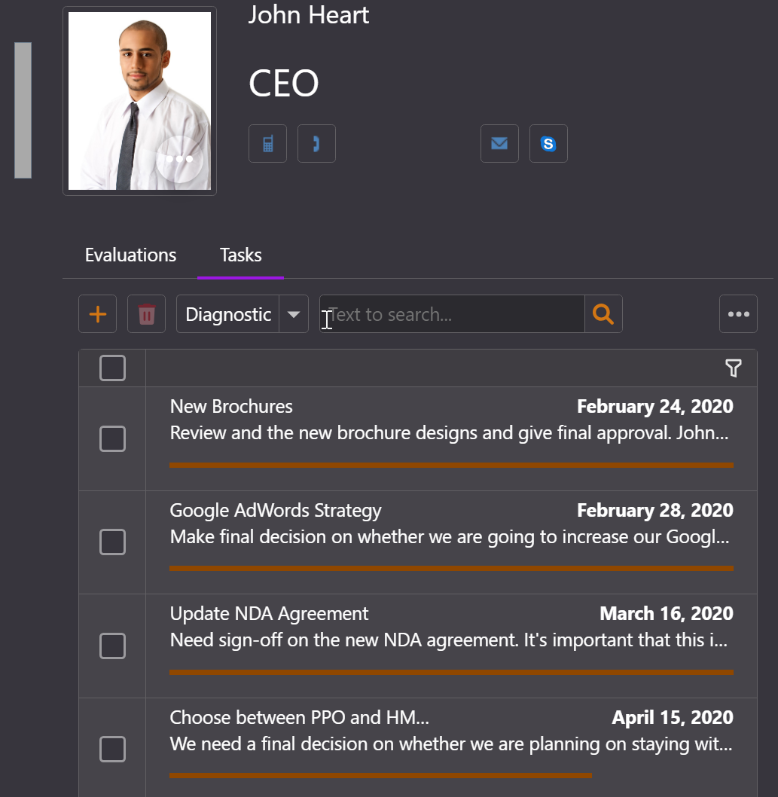

- #### Evaluations subfolder
  The `SchedulerGroupTypeController` is required to set up the scheduler, as follows:

  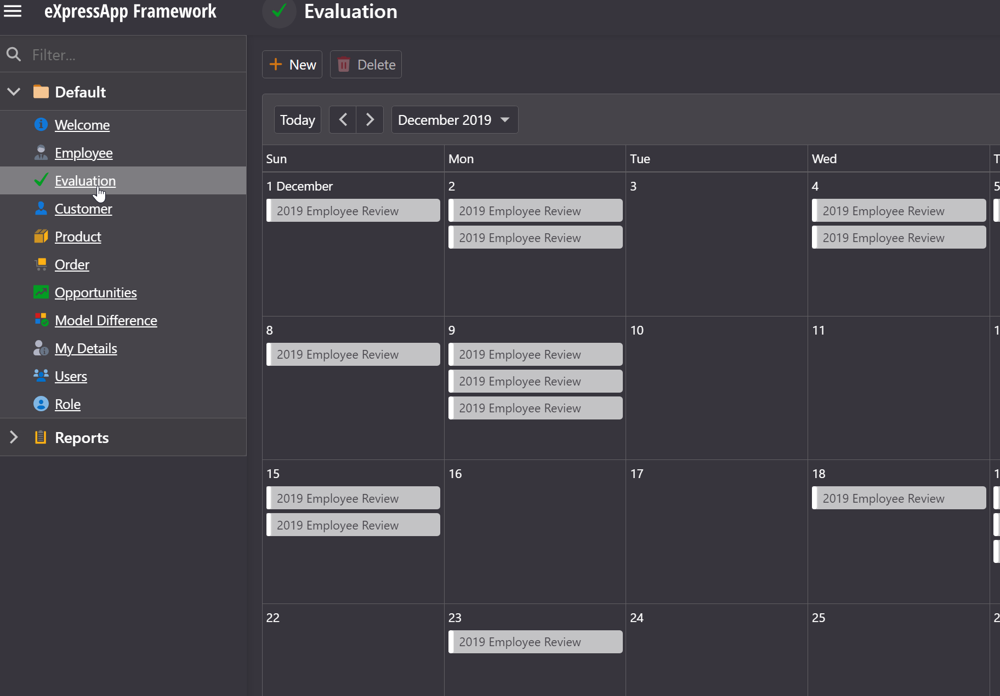

- #### Maps subfolder
  Mirroring its WinForms counterpart, this subfolder contains both the `RouteMapsViewController` and the `SalesMapsViewController`. These controllers are needed to configure maps (`ModalDxMap` and `ModalDxVectorMap`) and associated actions (such as `TravelMode`, `SalesPeriod`, `Print`, etc). Components within this directory are fragments that use components in `Components/DevExtreme`. Additionally, they adjust height as they are displayed in a modal popup window.
 
- #### Orders subfolder
  The `DetailRow` component renders the detail fragment for the `OrderListView`.

  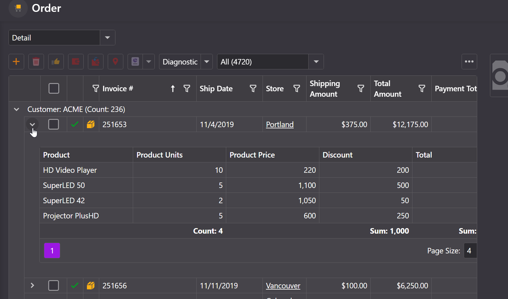

- #### Products subfolder
  Much like the _Employees_ subfolder, the `Component/CardViews/StackedCardView` declaration is as follow:

  [Features/Products/CardView.razor](https://github.com/DevExpress-Examples/xaf-create-multitenant-application/blob/24.1.2%2B/CS/OutlookInspired.Blazor.Server/Features/Products/CardView.razor):

  ```razor
  <StackedCardView>
    <Content>
        @foreach (var product in ComponentModel.Objects) {
             <SideBySideInfoCard CurrentObject="product" ComponentModel="@ComponentModel" Image="@product.PrimaryImage.Data.ToBase64Image()" HeaderText="@product.Name" 
                                 InfoItems="@(new Dictionary<string, string>{{ "COST", product.Cost.ToString("C") },
                                                { "SALE PRICE", product.SalePrice.ToString("C") } })"
                                 FooterText="@product.Description.ToDocument(server => server.Text)"/>
         }

    </Content>
  </StackedCardView>
  ```

  Results are as follows:

  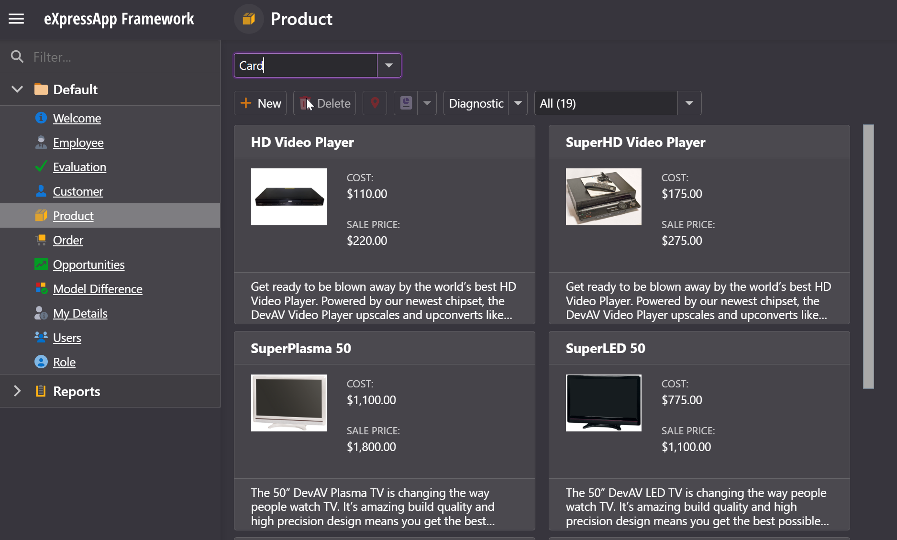
<!-- feedback -->
## Does this example address your development requirements/objectives?

[](https://www.devexpress.com/support/examples/survey.xml?utm_source=github&utm_campaign=xaf-create-multitenant-application&~~~was_helpful=yes) [](https://www.devexpress.com/support/examples/survey.xml?utm_source=github&utm_campaign=xaf-create-multitenant-application&~~~was_helpful=no)

(you will be redirected to DevExpress.com to submit your response)
<!-- feedback end -->
